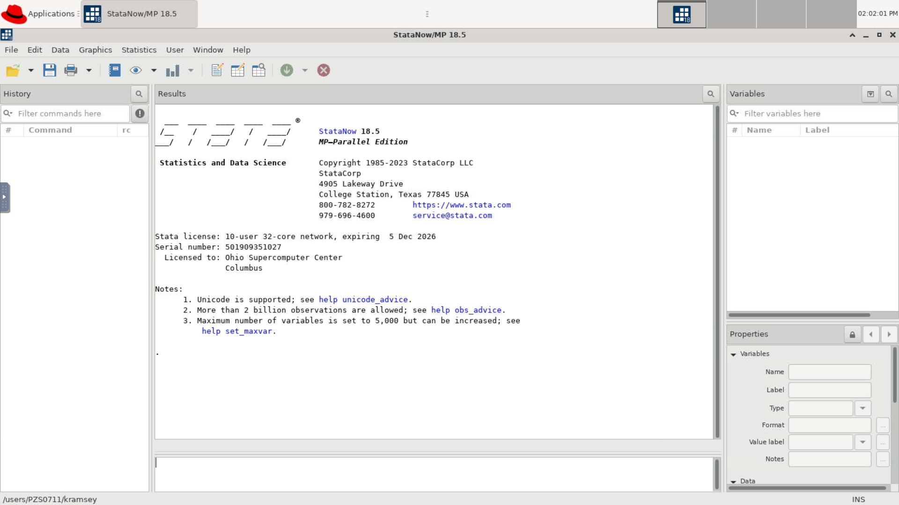

# Batch Connect - OSC Stata 


[](https://opensource.org/licenses/MIT)

## Overview

OSC Stata is an Open OnDemand Batch Connect app designed for OSC that launches Stata within an interactive desktop session on HPC clusters. Stata is designed for researchers who need data analysis and visualization.

- Upstream Project: [Stata](https://www.stata.com/)

## Screenshots



## Features

- Launches Stata via an interactive session
- Supports CPU-based statistical computing workloads
- Configurable cores, wall time, and node type via the launch form
- Module-based environment using Lmod 

## Requirements

### Compute Node Software

- [Stata] 15
- [Xfce Desktop] 4+

For VNC server support:

- [TurboVNC] 2.1+
- [websockify] 0.8.0+

### Open OnDemand

- Open OnDemmand 2.x or newer
- Scheduler: Slurm

### Optional

- [Lmod] 6.0.1+ or any other `module purge` and `module load <modules>` based CLI used to load appropriate environments within the batch job

[Stata]: https://www.stata.com/
[Xfce Desktop]: https://xfce.org/
[TurboVNC]: http://www.turbovnc.org/
[websockify]: https://github.com/novnc/websockify
[Lmod]: https://www.tacc.utexas.edu/research-development/tacc-projects/lmod

## App Installation

### 1. Clone the repository
```sh
cd /var/www/ood/apps/sys
git clone https://github.com/OSC/bc_osc_stata.git
cd bc_osc_stata

# Pin to a release (recommended)
git checkout v0.9.1
```

You will not need to do anything beyond this as all necessary assets are
installed. You will also not need to restart this app as it isn't a Passenger app.

To update the app you would:

```sh
cd bc_osc_stata
git fetch
git checkout <tag/branch>
```

Again, you do not need to restart the app as it isn't a Passenger app.

### 2. Configure for your site

Edit `form.yml` and update these values for your cluster:

| Attribute | Default | Change to |
|-----------|---------|-----------|
| `cluster` | `"cardinal"` | Your cluster name |
| `stata_version` | `"stata/18"` | The version of Stata available on your system |
| `node_type` | OSC-specific node types | Node types available on your system |
|

### 3. Verify

No OOD restart is needed (Batch Connect apps are detected automatically). Visit your OOD dashboard and look for **Stata** under **Interactive Apps > GUIs**.

## Configuration

### form.yml attributes

| Attribute | Description | Default |
|-----------|-------------|---------|
| `cluster` | Target cluster ID | `"cardinal"` |
| `stata_version` | Stata version to launch via stata/ module| stata/18 |
| `bc_num_hours` | Maximum wall time (hours) | 1 |
| `bc_num_slots` | Number of scheduler slots requested (number of nodes) | 1 | 
| `num_cores` | Number of CPU cores (1--96, varies by node type/cluster) | 1 |
| `node_type` | Compute node type (any, hugemem) | `"any"` |
| `bc_vnc_resolution` | Resolution of VNC desktop session | 1228 x 691 |

### Environment Variables

| Variable | Required | Description |
| STATA_HOME | Yes | Path to Stata installation root |

## Troubleshooting

### Job starts but app doesn't appear (Batch Connect)

1. Check the job's `output.log` in `~/ondemand/data/sys/YOUR-APP/`
2. Verify the module loads correctly: `module load software/1.0`
3. Verify the window manager is installed: `which xfwm4`

### Connection timeout

The app may need more time to start. Increase the connection timeout or check that the compute node can open the required port.

##Testing

| Site                      | OOD Version    | Scheduler | Status     |
|---------------------------|----------------|-----------|------------|
| Ohio Supercomputer Center | 4.1.4 | Slurm     | Production |

To verify your installation:

1. Launch the app from the OOD dashboard with default settings
2. Confirm the application loads in the browser

## Known Limitations

- No GPU support

## Contributing

Contributions are welcome. To contribute:

1. Fork this repository
2. Create a feature branch (`git checkout -b feature/my-improvement`)
3. Submit a pull request with a description of your changes

For bugs or feature requests, [open an issue](https://github.com/OSC/bc_osc_stata/issues).

This app is part of the [OOD Appverse](https://ondemand.connectci.org/affinity-groups/ood-appverse). Join the [Appverse Affinity Group](https://ondemand.connectci.org/affinity-groups/ood-appverse) to connect with other contributors.

## References

- [Stata](https://www.stata.com) - The application launched by this OOD app
- [Open OnDemand](https://openondemand.org/) — the HPC portal framework

## License

* Documentation, website content, and logo is licensed under
  [CC-BY-4.0](https://creativecommons.org/licenses/by/4.0/)
* Code is licensed under MIT (see LICENSE.txt)o
* The pictures, icons, and logos encoded in gif files and other formats are either copyrights and/or trademarks of StataCorp LLC.

## Acknowledgments

This app is built on [Open OnDemand](https://openondemand.org/), developed and
maintained by the [Ohio Supercomputer Center (OSC)](https://www.osc.edu/).

Open OnDemand is supported by the National Science Foundation under awards
[NSF SI2-SSE-1534949](https://www.nsf.gov/awardsearch/showAward?AWD_ID=1534949)
and [NSF CSSI-Frameworks-1835725](https://www.nsf.gov/awardsearch/showAward?AWD_ID=1835725).
